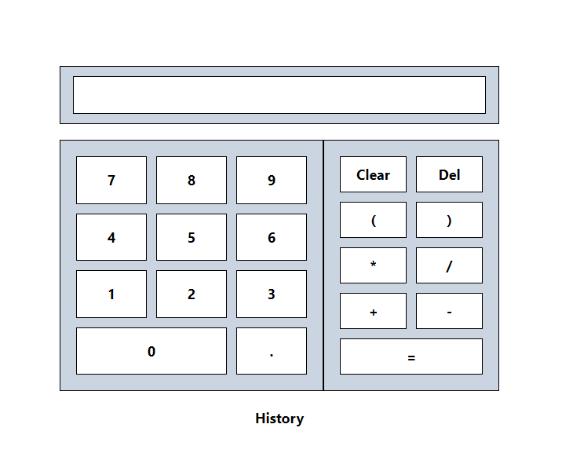

# Odin Project: Calculator

## Live Preview

[odin-project-calculator](https://gamadjg.github.io/odin-project-calculator/)

---

## Overview

Calculator application which served as the initial introduction to logic and DOM manipulation with javascript. Revamped in 2023 to include jQuery, and Tailwindcss.

---

## Features

- Built with Javascript, jQuery, Tailwindcss, HTML5, CSS3
- Event listeners for both in-app-button presses, and keyboard presses integrated.
- Error detection and display for: incorrect or unclosed parenthesis, incomplete operations.
- History list for the user to see what operations were previously entered.
